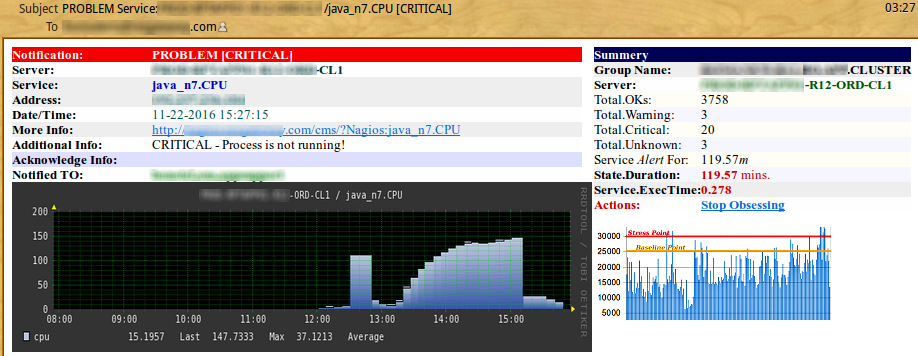

# Nagios Send HTML Alert eMails

This is the Version 3 of the popular 'Send HTML Alert Email'. Nagios Alert eMails now contain formatted Text & Performance Graphs. Tested with Nagios v3 & 4.
Contains Useful Features Like ---
* Performance Graphs
* Total Downtime of the Service upon Recovery
* 4 Colour Coordinated Alerts
* Group & Email Information.
* Low bandwidth usage when downloading hundreds/thousands of Alerts Emails.
* Takes less than 10 minutes to setup.




**First Download the three .php files to the nagios/libexec/ folder and give them execution permission**

1. Open the three php files and check if the 1st line path/to/php and .ini files are correct
2. In the three .php files, change the $from email variable to a real name(Else your Email Server might Reject it / or SPAM it).
3. In the three .php files, change the $f_domain to your nagios webserver domain name.
4. In the "graph_auth.php", change the $login and $password to your nagios username & password.
5. Create a new folder "/usr/local/nagios/cms" and move the "graph_auth.php" and "a_11.png" file to the "/usr/local/nagios/cms/"

[Note: Do not put the graph_auth.php or a_11.png in the /usr/local/nagios/share/ as this folder requires the username/passwd when viewing]

Now edit the "nagios/etc/objects/command.cfg" and replace the [notify-service-by-email] block with the following block.
```
define command{
  command_name notify-service-by-email
  command_line /usr/local/nagios/libexec/nagios_service_mail.php "$NOTIFICATIONTYPE$" "$HOSTNAME$" "$HOSTALIAS$" "$HOSTSTATE$" "$HOSTADDRESS$" "$SERVICEOUTPUT$" "$SHORTDATETIME$" "$SERVICEDESC$" "$SERVICESTATE$" "$CONTACTEMAIL$" "$SERVICEDURATIONSEC$" "$SERVICEEXECUTIONTIME$" "$TOTALSERVICESWARNING$" "$TOTALSERVICESCRITICAL$" "$TOTALSERVICESUNKNOWN$" "$NOTIFICATIONRECIPIENTS$" "$TOTALSERVICESOK$" "$SERVICENOTIFICATIONNUMBER$" "$SERVICEACKCOMMENT$" "$HOSTGROUPNAME$" "$SERVICEPERFDATA$"
}
```

**Also replace the [notify-host-by-email] code block with the following block**

```
define command{
  command_name notify-host-by-email
  command_line /usr/local/nagios/libexec/nagios_host_mail.php "$NOTIFICATIONTYPE$" "$HOSTNAME$" "$HOSTALIAS$" "$HOSTSTATE$" "$HOSTADDRESS$" "$HOSTOUTPUT$" "$SHORTDATETIME$" "$SERVICEDESC$" "$SERVICESTATE$" "$CONTACTEMAIL$" "$TOTALHOSTSUP$" "$TOTALHOSTSDOWN$" "$HOSTGROUPNAME$" "$SERVICEPERFDATA$"
}
```

Check your nagios/libexec folder paths are accurate and save the "command.cfg" file.
In order to get the graph to render, we need to configure the Apache "httpd.conf" file. Go ahead and open the "/etc/httpd/conf/httpd.conf" and add an extra VirtualHost as follows.. (The ServerName & ServerAlias should be your nagios domain name)

```
<VirtualHost *:80>
  ServerAdmin operations@mycompany.com
  ServerName nagios.company.com
  ServerAlias nagios.company.com
  DocumentRoot "/usr/local/nagios/cms"
  ErrorLog logs/nagios-error_log
</VirtualHost>
```

The emails are sent using the PHP mail() function. A set of temporary files are written to the root level /tmp folder in order to determine the Total Downtime upon Service Recovery. Many MACROS are used in order to boost the Usable Data, hence I am not sure if it will work on Older Nagios v2.0.

---

[Optional Bonus]: If you have CMSimple "Content Management" installed, you can create a custom link which Network Staff can click and get the details of every single Service Type and Description. In order to do this, you will need to install the CMSimple and create headings with Identical Names as the Service Name in Nagios. The dummy domain nagios.cmsnagios.com was used as the Nagios WebSite. The CMSimple was used to compliment the New Network Staff.

For example: In Nagios/ Server Win32 DOG7 has a service name cpu_load (which describes the CPU), create a CMS heading cpu_load and write a detailed description about it.
You may email me for further descriptions on CMS Manipulations.

Let me know if you have any queries regarding the Email plugins.. Would love to hear from you.. 

